# ZiMart E-Commerce Backend

---

**Members:** 
- Tenzin Namgay - 02230307 
- Rangjung Yeshi Norbu - 02230297
- Youten Kinley Tenzin - 02230313

**Module:** DBS302: NoSQL Database Management  
**Date:** June 2026  

---

## Table of Contents

1. [Abstract](#1-abstract)
2. [System Architecture](#2-system-architecture)
3. [Tech Stack Justification](#3-tech-stack-justification)
4. [Data Modeling](#4-data-modeling)
5. [MongoDB Advanced Features](#5-mongodb-advanced-features)
6. [Redis Implementation](#6-redis-implementation)
7. [Caching Strategy](#7-caching-strategy)
8. [Non-Functional Requirements Coverage](#8-non-functional-requirements-coverage)
9. [API Endpoints Summary](#9-api-endpoints-summary)
10. [Performance Benchmarks](#10-performance-benchmarks)
11. [Challenges and Solutions](#11-challenges-and-solutions)
12. [Future Enhancements](#12-future-enhancements)
13. [References](#13-references)

---

## 1. Abstract

ZiMart is a RESTful e-commerce backend built to demonstrate the practical application of polyglot persistence, meaning the use of multiple specialised database technologies within a single system. The system pairs MongoDB Atlas, a distributed document-oriented database, with Redis Cloud, an in-memory data store, to serve distinct workloads efficiently. MongoDB handles durable, schema-flexible document storage across six collections (User, Product, Category, Order, Review, and Inventory), while Redis accelerates read-heavy paths through caching, manages short-lived session state, enforces rate limits, tracks trending products via sorted sets, and records recently viewed items via lists. The backend is implemented in Node.js with Express 5, exposes twenty-two REST endpoints across five routers, and enforces JWT-based authentication with Redis-backed session revocation. Advanced MongoDB features, including compound indexes, full-text search, multi-document ACID transactions, and aggregation pipelines, are demonstrated through real product and order workflows. This report documents every design decision, data modelling trade-off, and non-functional requirement addressed by the system.

---

## 2. System Architecture

### 2.1 High-Level Architecture

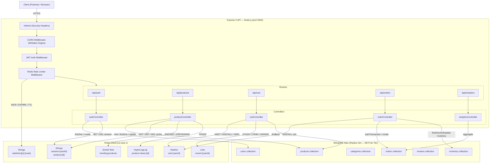

### 2.2 Request Lifecycle

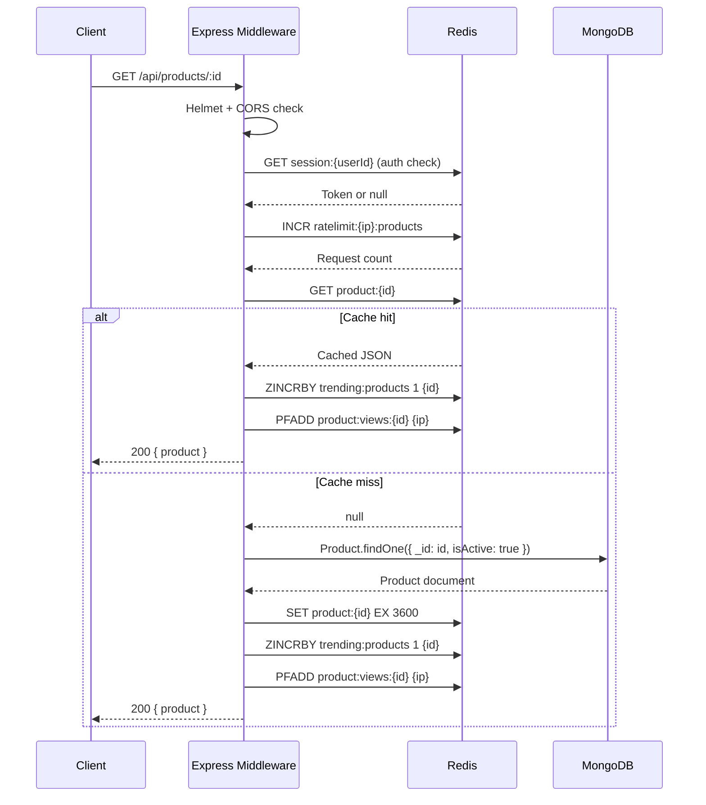

### 2.3 Order Placement with ACID Transaction

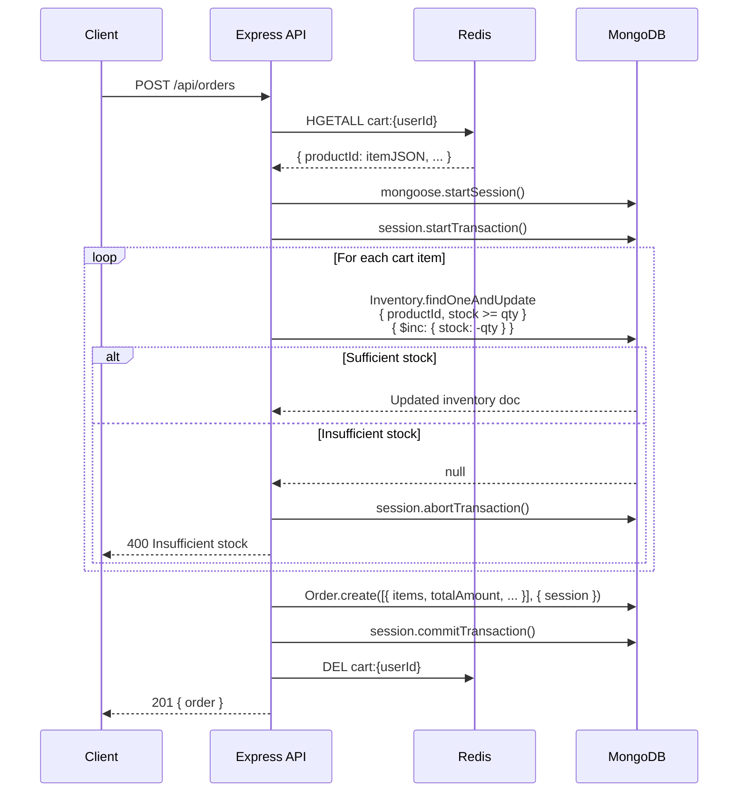

---

## 3. Tech Stack Justification

### 3.1 Node.js + Express 5

Node.js was selected for its event-driven, non-blocking I/O model, which is well suited to an API server that spends most of its time waiting on I/O from MongoDB and Redis rather than performing CPU-bound work. A single Node.js process can handle thousands of concurrent connections efficiently without spawning a thread per request, reducing memory overhead compared to thread-per-request server models [1].

Express 5 was chosen as the HTTP framework for its minimal footprint, mature middleware ecosystem, and first-class async/await error propagation, a notable improvement over Express 4, where unhandled async rejections required explicit wrapping. The `next(err)` pattern used in ZiMart's controllers flows directly to a centralised error handler without additional boilerplate.

### 3.2 MongoDB Atlas

MongoDB's document model aligns naturally with the heterogeneous data shapes present in e-commerce. A product document, for example, may contain a `variants` array (size, colour, SKU), a free-form `attributes` object (material, weight, dimensions), and embedded `ratings` — shapes that would require multiple joined tables in a relational model but map directly to a single BSON document. Key advantages leveraged in ZiMart include:

- **Flexible schema:** The `attributes` field uses `Schema.Types.Mixed`, allowing sellers to attach product-specific metadata without a schema migration.
- **Embedded documents:** Order items, shipping addresses, and cart snapshots are embedded rather than referenced, eliminating join-equivalent lookups at read time and ensuring historical immutability (prices embedded in orders never change even if the product price is updated later).
- **Horizontal scalability:** MongoDB Atlas supports native sharding, making the data layer independently scalable from the application layer [2].
- **Atlas-managed replica sets:** All Atlas tiers deploy a three-node replica set, providing automatic failover and read-preference routing without operational overhead.

### 3.3 Redis Cloud

Redis complements MongoDB by handling workloads where sub-millisecond latency and specialised data structures are required [3]:

- **Session state** demands low-latency reads on every authenticated request — a Redis `GET` is orders of magnitude faster than a MongoDB document lookup.
- **Rate limiting** requires an atomic increment-and-expire operation. Redis `INCR` and `EXPIRE` are atomic at the command level, eliminating the race conditions inherent in a read-modify-write cycle against a general-purpose database.
- **Trending leaderboards** are a canonical sorted set use case: `ZINCRBY` and `ZREVRANGE` provide O(log N) insertion and O(log N + M) range retrieval, far more efficient than issuing an aggregation pipeline on every trending request.
- **HyperLogLog** for unique visitor counting trades a small error margin (≤0.81%) for a fixed memory footprint of 12 KB per key, regardless of cardinality [4].
- **Caching** with configurable TTLs shifts repeated read traffic away from MongoDB, reducing Atlas compute consumption.

---

## 4. Data Modeling

### 4.1 Embedding vs. Referencing Decision Matrix

The central trade-off in MongoDB data modelling is between embedding (denormalisation) and referencing (normalisation). Embedding favours read performance and atomicity; referencing favours data consistency and independent lifecycle management [5].

| Collection | Embedded Subdocuments | Referenced Documents | Rationale |
|---|---|---|---|
| **User** | `addresses[]`, `paymentPreferences` | `wishlist[]` → Product | Addresses and payment preferences are private to the user, always fetched together, and never queried independently — embedding avoids a separate lookup on every profile load. The wishlist references Products because product documents are large and product data (price, stock) changes independently. |
| **Product** | `variants[]`, `ratings`, `attributes` | `category` → Category, `sellerId` → User | Variants (size, colour, SKU) are intrinsic to the product and always needed together. Ratings are a computed aggregate updated in place. Category and seller are shared entities with independent lifecycles — referencing avoids duplication and inconsistency. |
| **Category** | — | `parentCategory` → Category (self-ref) | Self-referencing ObjectId enables an arbitrarily deep category tree (Electronics → Phones → Smartphones) without a fixed-depth schema. |
| **Order** | `items[]` (with name + price snapshot), `shippingAddress` | `userId` → User | Order items embed a price snapshot at the time of purchase, ensuring historical accuracy even if the product price changes later. Shipping address is copied at checkout for the same reason. userId references the User for account-level queries. |
| **Review** | — | `userId` → User, `productId` → Product | Reviews are an independent entity queried by product or by user, never always fetched with either — referencing is correct here. A compound unique index on `(userId, productId)` enforces one review per user per product. |
| **Inventory** | — | `productId` → Product (1:1, unique) | Inventory is separated from Product to allow atomic stock decrements in transactions without touching the large product document. The 1:1 unique index ensures one inventory record per product. |

### 4.2 Index Definitions

| Collection | Index | Type | Purpose |
|---|---|---|---|
| Product | `name + description + tags` | Text (compound) | Full-text search via `$text: { $search }` query operator |
| Product | `category + price` | Compound | Filtered browsing by category with price-range sorting |
| Order | `userId + createdAt (desc)` | Compound | Paginated order history queries per user |
| Order | `status` | Single-field | Admin queries filtering by fulfilment status |
| Review | `userId + productId` | Compound unique | One-review-per-user constraint and lookup |
| Review | `productId + createdAt (desc)` | Compound | Product review pages, newest first |
| Category | `parentCategory` | Single-field | Tree traversal (find all children of a parent) |
| Inventory | `stock` | Single-field | Low-stock threshold alert queries |

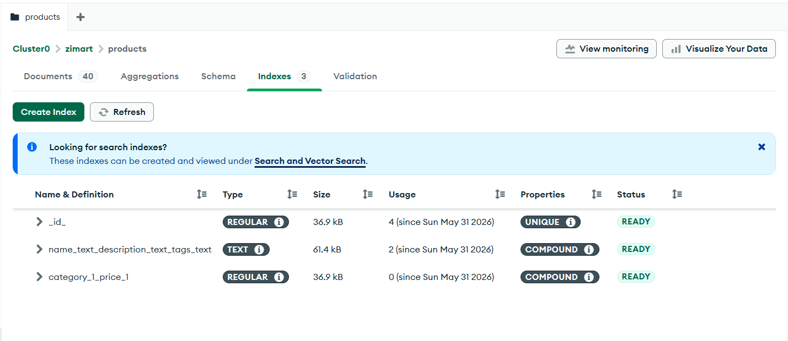

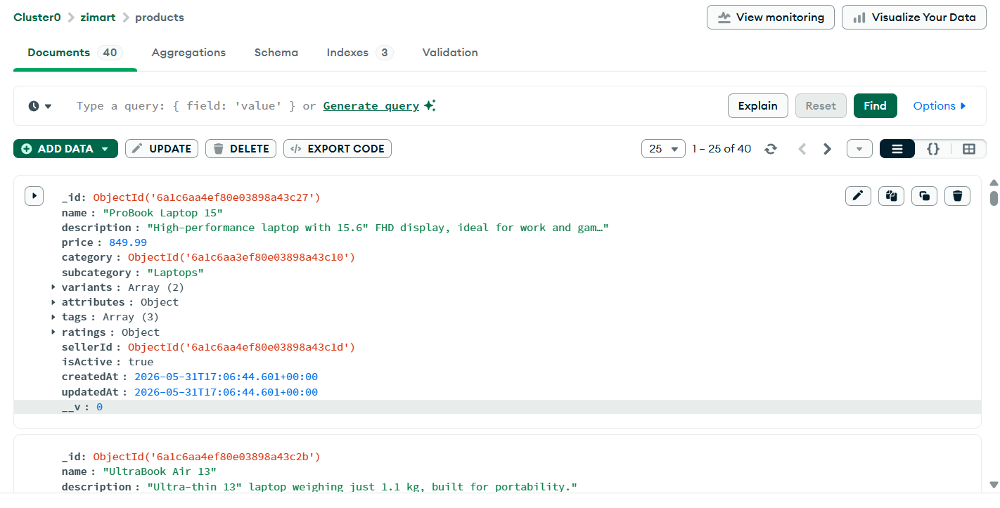

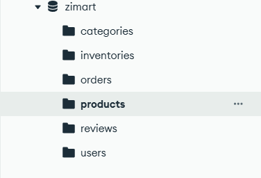

---

## 5. MongoDB Advanced Features

### 5.1 Full-Text Search

The Product model defines a compound text index across `name`, `description`, and `tags`. When a `search` query parameter is provided to `GET /api/products`, the controller activates this index:

```javascript
if (search) filter.$text = { $search: search };

const sortObj = search
  ? { score: { $meta: 'textScore' }, [sort]: order === 'desc' ? -1 : 1 }
  : { [sort]: order === 'desc' ? -1 : 1 };

const projection = search ? { score: { $meta: 'textScore' } } : {};
```

When text search is active, results are sorted by relevance score (`$meta: 'textScore'`) as the primary sort key, falling back to the caller-specified sort field as a tiebreaker. This ensures that the most relevant results appear first without discarding the caller's ordering preference.

### 5.2 Aggregation Pipelines

ZiMart implements two aggregation pipelines in `analyticsController.js`, both restricted to admin users.

**Monthly Sales Report (`GET /api/analytics/sales`):**

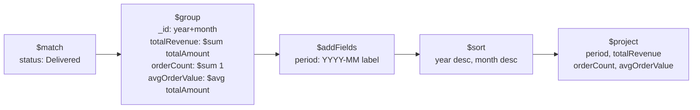

**Top Products by Sales (`GET /api/analytics/top-products`):**

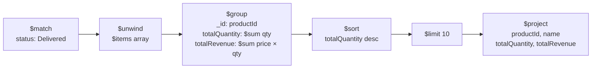

The `$unwind` stage is critical in the top-products pipeline: it deconstructs the embedded `items` array in each order document into individual documents (one per line item), enabling grouping by `productId` across all orders. Without `$unwind`, `$group` would only see the array as a single field.

### 5.3 ACID Transactions

Order placement in `orderController.js` wraps all stock decrements and order creation in a single multi-document ACID transaction:

```javascript
const session = await mongoose.startSession();
session.startTransaction();
try {
  for (const item of cartItems) {
    const inv = await Inventory.findOneAndUpdate(
      { productId: item.productId, stock: { $gte: item.quantity } },
      { $inc: { stock: -item.quantity } },
      { session, new: true }
    );
    if (!inv) {
      await session.abortTransaction();
      return res.status(400).json({ message: `Insufficient stock for ${item.name}` });
    }
  }
  const [order] = await Order.create([orderData], { session });
  await session.commitTransaction();
} catch (err) {
  await session.abortTransaction();
  next(err);
} finally {
  session.endSession();
}
```

The guard condition `{ stock: { $gte: item.quantity } }` in `findOneAndUpdate` is the key concurrency safety mechanism: the update only executes if sufficient stock exists at the moment of the write. If a concurrent order has already decremented the stock below the required quantity, the update returns `null`, the transaction aborts, and all preceding decrements in the same transaction are rolled back atomically. This eliminates the possibility of overselling without requiring application-level locking.

### 5.4 Replica Set and High Availability

ZiMart connects to a MongoDB Atlas M0 cluster, which deploys a three-node replica set automatically. The primary node accepts all writes; the two secondary nodes replicate the oplog asynchronously and are eligible for election if the primary becomes unavailable. Atlas performs automatic failover in under 10 seconds, requiring no manual intervention [6]. The connection string includes the `appName=Cluster0` parameter, which appears in Atlas monitoring to identify this specific application's traffic.

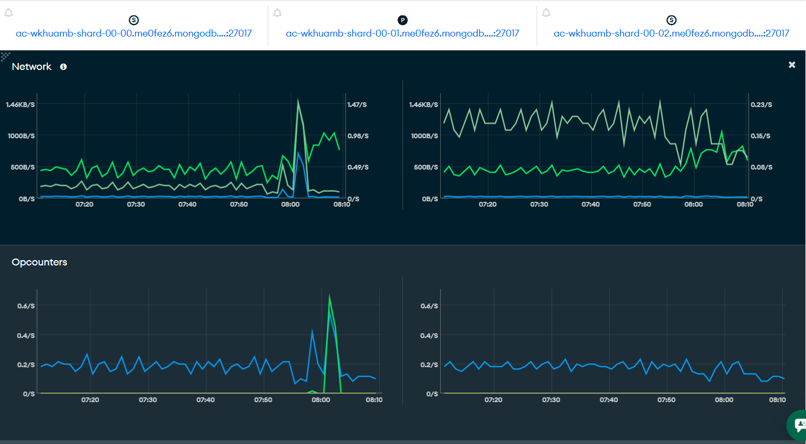


---

## 6. Redis Implementation

### 6.1 All Five Redis Data Types with Justification

Redis's value proposition is not just speed but its collection of purpose-built data structures. ZiMart uses all five primary types, each for the workload it is optimally designed for.

#### 6.1.1 Strings — Session Storage and Product Cache

| Key Pattern | Value | TTL | Commands |
|---|---|---|---|
| `session:{userId}` | JWT token string | 7 days | `SET`, `GET`, `DEL` |
| `product:{id}` | JSON-serialised product document | 1 hour | `SET EX`, `GET`, `DEL` |

Strings are the simplest structure but serve two distinct roles. Session keys store the raw JWT for revocation verification on every authenticated request; `DEL session:{userId}` on logout immediately invalidates all active sessions for that user, something impossible with stateless JWT alone. Product cache keys store JSON-serialised MongoDB documents, enabling the cache-aside pattern described in Section 7.

```javascript
// Store session with 7-day TTL
await redis.set(`session:${userId}`, token, 'EX', SESSION_TTL);

// Cache product document with 1-hour TTL
await redis.set(`product:${id}`, JSON.stringify(product), 'EX', PRODUCT_TTL);
```

#### 6.1.2 Hashes — Shopping Cart

| Key Pattern | Field | Value |
|---|---|---|
| `cart:{userId}` | `{productId}` | JSON `{ productId, name, price, quantity }` |

A Redis Hash maps naturally to a shopping cart: each field is a product ID, and each value is the serialised item. This structure enables O(1) lookup, addition, and removal of individual items (`HGET`, `HSET`, `HDEL`) without deserialising the entire cart. `HGETALL` fetches the complete cart for checkout in a single round trip. The cart TTL (7 days) is refreshed on every write, implementing a sliding expiry.

```javascript
// Add/update item atomically
await redis.hset(cartKey, productId, JSON.stringify(item));
await redis.expire(cartKey, CART_TTL);  // Refresh sliding TTL

// Fetch entire cart for checkout
const raw = await redis.hgetall(cartKey);
```

#### 6.1.3 Sorted Sets — Trending Products Leaderboard

| Key | Member | Score |
|---|---|---|
| `trending:products` | `{productId}` | Cumulative view count |

Every time a product is viewed, `ZINCRBY trending:products 1 {id}` atomically increments that product's score. The sorted set maintains a real-time leaderboard ordered by view count. Retrieving the top 10 trending products requires a single `ZREVRANGE trending:products 0 9 WITHSCORES` command, which returns members in descending score order in O(log N + 10) time.

```javascript
// On every product view
await redis.zincrby('trending:products', 1, productId);

// Trending endpoint
const raw = await redis.zrevrange('trending:products', 0, 9, 'WITHSCORES');
// raw = ['id1', '142', 'id2', '98', ...]
```

#### 6.1.4 HyperLogLog — Unique Visitor Counting

| Key Pattern | Elements Added | Use |
|---|---|---|
| `product:views:{id}` | Visitor IP address | Unique visitor count per product |

HyperLogLog is a probabilistic data structure that estimates the cardinality of a set using a fixed 12 KB of memory, regardless of how many unique elements have been added. ZiMart uses `PFADD product:views:{id} {visitorIp}` to record each view. The same IP added multiple times does not inflate the count. Error margin is ≤0.81%, acceptable for an analytical view counter. The memory efficiency compared to a Set (which would grow linearly with unique visitors) makes HyperLogLog ideal for high-cardinality counters [4].

```javascript
const visitor = req.headers['x-forwarded-for'] || req.ip || 'unknown';
await redis.pfadd(`product:views:${productId}`, visitor);
```

#### 6.1.5 Lists — Recently Viewed Products

| Key Pattern | Elements | Ordering |
|---|---|---|
| `recent:{userId}` | Product IDs | Most recent first (LPUSH to head) |

A Redis List stores the recently viewed product history per user. `LPUSH` inserts the latest product at the head of the list in O(1). `LTRIM 0 9` immediately truncates the list to 10 items, enforcing a fixed-size sliding window. A Redis pipeline batches these two commands plus `EXPIRE` into a single round trip, ensuring atomicity.

```javascript
const pipeline = redis.pipeline();
pipeline.lpush(recentKey, productId);
pipeline.ltrim(recentKey, 0, RECENT_MAX - 1);  // RECENT_MAX = 10
pipeline.expire(recentKey, CART_TTL);
await pipeline.exec();
```

#### 6.1.6 Rate Limiting Strings

| Key Pattern | Value | TTL |
|---|---|---|
| `ratelimit:{ip}:{route}` | Request count integer | Window duration |

Rate limiting uses regular String keys with integer values, exploiting `INCR`'s atomicity. The key is created by the first `INCR` (returns 1) and `EXPIRE` is set only on count 1, so subsequent increments within the same window do not reset the timer.

| Limiter | Limit | Window |
|---|---|---|
| `loginRateLimiter` | 10 requests | 60 seconds |
| `orderRateLimiter` | 5 requests | 60 seconds |

```javascript
const count = await redis.incr(key);
if (count === 1) await redis.expire(key, windowSeconds);
if (count > limit) {
  const ttl = await redis.ttl(key);
  return res.status(429).set({
    'X-RateLimit-Limit': limit,
    'X-RateLimit-Remaining': 0,
    'Retry-After': ttl,
  }).json({ message: 'Too many requests' });
}
```


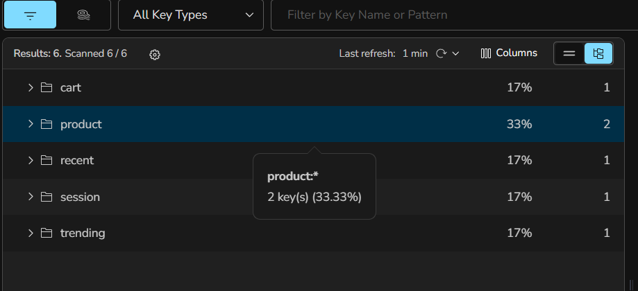

> **Note:** The `ratelimit:*` key is not visible in this snapshot because 
> Redis automatically expired it after the 60-second window elapsed — 
> this is the intended behaviour of the rate limiting implementation. 
> The `recent:*` key is grouped under the `recent` folder shown above. 
> Both keys were verified during testing as shown in the Postman screenshots below.

---

### 6.2 Redis Persistence Configuration

ZiMart uses Redis Cloud which configures **RDB (Redis Database) persistence** by default. RDB creates point-in-time snapshots of the dataset at specified intervals, providing durability with minimal performance overhead compared to AOF (Append Only File).

**Justification for RDB over AOF:**
- ZiMart's Redis data (sessions, cache, leaderboard) is semi-ephemeral — losing a few minutes of data on crash is acceptable
- RDB snapshots are compact and restore faster than AOF logs
- AOF would add write overhead on every Redis operation, impacting rate limiting and cache performance

### 6.3 Redis Eviction Policy

Redis Cloud is configured with **`volatile-ttl`** eviction policy.

**Justification:**
- ZiMart sets TTL on all keys (sessions, cache, cart, rate limits)
- `volatile-ttl` evicts keys with the shortest remaining TTL first when memory is full
- This naturally removes the least relevant cached data first
- Rate limit keys (60s TTL) expire before session keys (7 days TTL) — correct priority


## 7. Caching Strategy

### 7.1 Cache-Aside Pattern

ZiMart implements the cache-aside (lazy loading) pattern for product documents. The application is responsible for populating the cache on a miss; the cache is never written directly by the database.

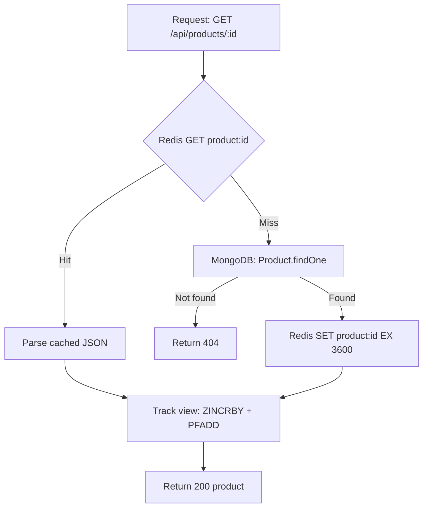

This pattern keeps MongoDB as the source of truth while Redis acts as an accelerator. The application never needs to synchronise the two stores proactively; stale cache entries simply expire after their TTL.

### 7.2 TTL Decisions

| Cache Key | TTL | Rationale |
|---|---|---|
| `product:{id}` | 3600 s (1 hour) | Product details (price, description) change infrequently; a 1-hour staleness window is acceptable for a browsing use case. |
| `session:{userId}` | 604800 s (7 days) | Matches the JWT expiration period so session and token always expire together. |
| `cart:{userId}` | 604800 s (7 days), sliding | Cart TTL resets on every mutation, preventing abandoned carts from expiring during active shopping sessions. |
| `recent:{userId}` | 604800 s (7 days), sliding | Recently viewed history is useful for the duration of a shopping session; same sliding window as cart. |
| `ratelimit:{ip}:*` | 60 s (fixed window) | Rate limit windows are short (60 s) so abusive clients are temporarily blocked without permanent impact. |

### 7.3 Cache Invalidation Strategy

ZiMart uses **explicit invalidation** (also known as write-through invalidation): whenever a product is updated (`PUT /api/products/:id`) or soft-deleted (`DELETE /api/products/:id`), the cache key is deleted immediately before the response is sent.

```javascript
// After successful update
await redis.del(`product:${id}`);
```

The next read for that product will miss the cache and repopulate it with the fresh MongoDB document. This approach accepts a brief window of cache-miss latency after a write in exchange for never serving stale data beyond the TTL boundary.

### 7.4 Cache Stampede Prevention

A cache stampede occurs when many concurrent requests miss the cache simultaneously (e.g., after a TTL expiry or a deliberate invalidation) and all race to populate it, overwhelming the database. ZiMart's current implementation accepts this risk at low traffic levels, where the probability of simultaneous misses on the same key is negligible. At higher scale, a probabilistic early expiration algorithm (PER) or a mutex lock (Redis `SET NX EX` pattern) could be introduced to ensure only one request rebuilds the cache while others wait.

---

## 8. Non-Functional Requirements Coverage

### NFR1 — Performance

| Mechanism | Implementation | Impact |
|---|---|---|
| Redis product cache | `GET product:{id}` on every product view | Eliminates MongoDB round-trip on cache hit; sub-millisecond vs. ~10–50 ms |
| `.lean()` on read queries | All list and detail queries use `.lean()` | Returns plain JS objects instead of Mongoose documents, skipping hydration overhead |
| Compound indexes | `category + price` on Product, `userId + createdAt` on Order | Index-covered range queries avoid collection scans |
| Redis pipeline | `addToRecentlyViewed` batches 3 commands | Reduces round trips from 3 to 1 |
| Pagination cap | `limit = Math.min(100, limit)` | Prevents unbounded query result sets |

### NFR2 — Scalability

| Mechanism | Implementation |
|---|---|
| Stateless API | JWT auth + Redis session; any API instance can serve any request |
| MongoDB Atlas sharding-ready | Atlas supports horizontal sharding; ZiMart's data model is partition-friendly by `userId` and `category` |
| Redis as shared state layer | Rate limit counters and sessions are stored in Redis, not in-process memory, so they work correctly across multiple Node.js instances |
| Separate Inventory collection | Inventory stock decrements are isolated from the large Product document, reducing write contention during high-order volume |

### NFR3 — High Availability

| Mechanism | Implementation |
|---|---|
| MongoDB Atlas replica set | Three-node replica set with automatic primary election; ≤10 s failover [6] |
| Redis ioredis reconnection | ioredis automatically reconnects on connection loss with exponential backoff |
| Rate limiter fail-open | If Redis is unavailable, the rate limiter calls `next()` immediately, preventing Redis downtime from blocking all requests |
| Graceful startup | `connectDB()` calls `process.exit(1)` on MongoDB connection failure, preventing a zombie server that accepts requests it cannot serve |

### NFR4 — Consistency

| Mechanism | Implementation |
|---|---|
| ACID transactions | Order placement and inventory decrement are atomic; partial fulfilment is impossible |
| Stock guard condition | `findOneAndUpdate({ stock: { $gte: qty } })` prevents negative inventory without application-level locking |
| Session revocation | `DEL session:{userId}` on logout enforces immediate consistency between token validity and session state |
| Compound unique index | `(userId, productId)` on Review enforces one-review-per-user at the database level, not just application level |

### NFR5 — Durability

| Mechanism | Implementation |
|---|---|
| MongoDB write concern | Atlas default write concern is `majority` — writes are acknowledged only after replication to a majority of nodes [6] |
| Embedded order snapshots | Order items embed name and price at purchase time, preserving the historical record even if the product is later updated or deleted |
| Transaction commit before cart clear | `DEL cart:{userId}` executes only after `session.commitTransaction()` succeeds; a process crash between commit and cart clear leaves an orphaned cart that expires via its 7-day TTL |

### NFR6 — Security

| Mechanism | Implementation |
|---|---|
| Password hashing | bcryptjs with 12 cost rounds; hash is never returned in API responses (`toJSON` strips it) |
| JWT expiration | 7-day expiration; `jwt.verify` rejects expired tokens without database consultation |
| Redis session revocation | Logout deletes the session key; re-use of a valid JWT after logout is blocked at the session check |
| Role-based access control | `roleCheck` middleware enforces seller/admin separation; customers cannot create products or update order status |
| Role escalation prevention | Self-registration only allows `customer` or `seller` roles; `admin` cannot be claimed via the public endpoint |
| CORS whitelist | `ALLOWED_ORIGINS` environment variable; unlisted origins receive a CORS error |
| Helmet security headers | `X-Content-Type-Options`, `X-Frame-Options`, `Content-Security-Policy`, and others applied globally |
| Rate limiting | Login: 10 req/60 s per IP; Order placement: 5 req/60 s per IP |

### NFR7 — Observability

| Mechanism | Implementation |
|---|---|
| Startup logging | `MongoDB connected: {host}` and `Redis connected` on startup |
| `GET /health` endpoint | Returns `{ status: 'ok' }` for load-balancer health checks |
| `GET /api/routes` endpoint | Introspects the Express router stack and returns all registered method + path combinations |
| Error propagation | `next(err)` in controllers routes unhandled errors to Express's centralised error handler |
| Rate limit headers | `X-RateLimit-Limit`, `X-RateLimit-Remaining`, `X-RateLimit-Reset`, `Retry-After` on every rate-limited response |

### NFR8 — Data Integrity

| Mechanism | Implementation |
|---|---|
| Mongoose schema validation | Required fields, enum constraints, min/max validators enforced at the ODM layer before any write reaches MongoDB |
| Unique indexes | Email (User), slug + name (Category), productId (Inventory), userId+productId (Review) |
| Order status state machine | `STATUS_TRANSITIONS` object in `orderController` enforces linear progression (Placed → Confirmed → Shipped → Delivered); backwards transitions and status skipping return 400 |
| Inventory lower bound | `stock: { type: Number, min: 0 }` prevents negative stock values at the schema level |
| Soft delete | Products are marked `isActive: false` rather than deleted; referential integrity in existing orders is preserved |


---

## 9. API Endpoints Summary

### 9.1 Authentication (`/api/auth`)

| Method | Path | Auth | Description |
|---|---|---|---|
| POST | `/api/auth/register` | Public | Register new user (customer or seller) |
| POST | `/api/auth/login` | Public + Rate limit (10/60s) | Authenticate and receive JWT |
| POST | `/api/auth/logout` | JWT | Revoke session |
| GET | `/api/auth/profile` | JWT | Fetch own user profile |

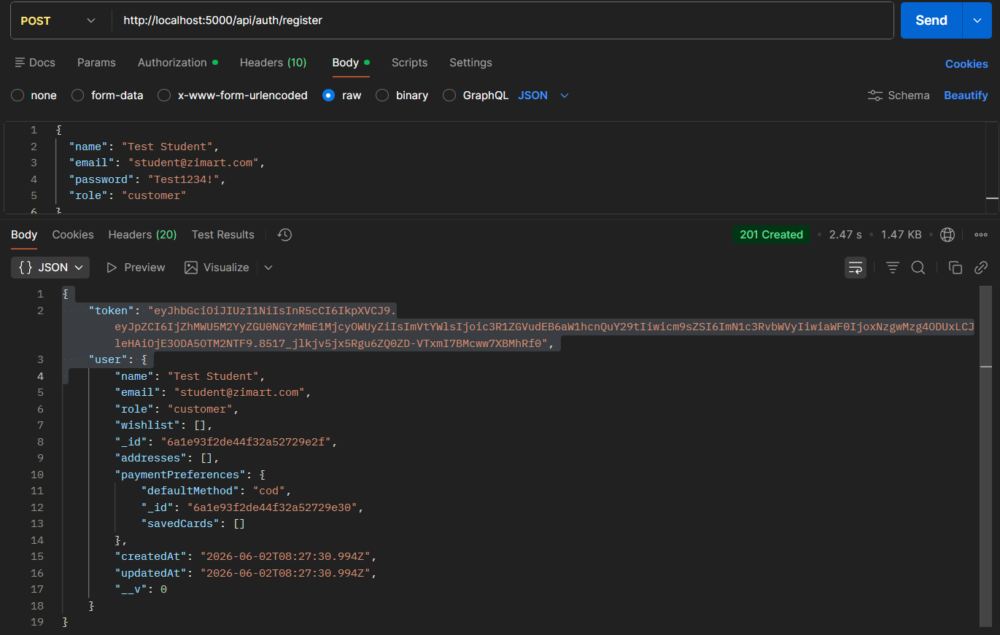

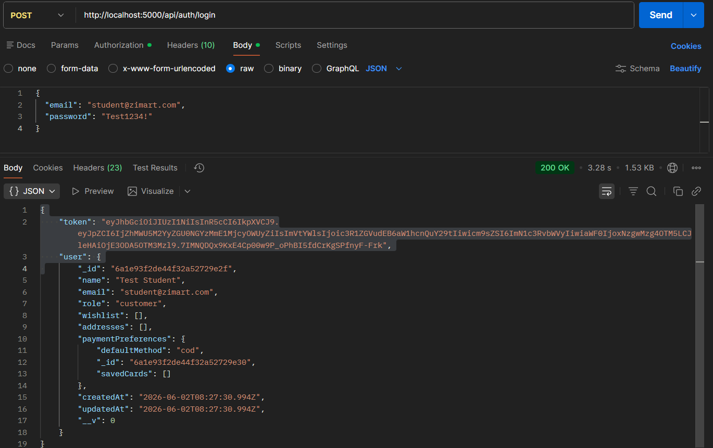

### 9.2 Products (`/api/products`)

| Method | Path | Auth | Description |
|---|---|---|---|
| GET | `/api/products` | Public | List products with filtering, search, and pagination |
| GET | `/api/products/trending` | Public | Top 10 trending products by view count |
| GET | `/api/products/:id` | Public | Single product detail with cache-aside |
| POST | `/api/products` | Seller / Admin | Create new product listing |
| PUT | `/api/products/:id` | Seller (own) / Admin | Update product |
| DELETE | `/api/products/:id` | Admin | Soft-delete product |

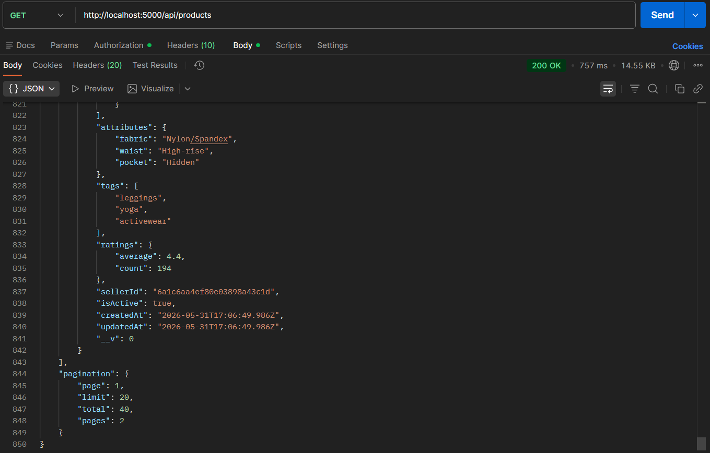
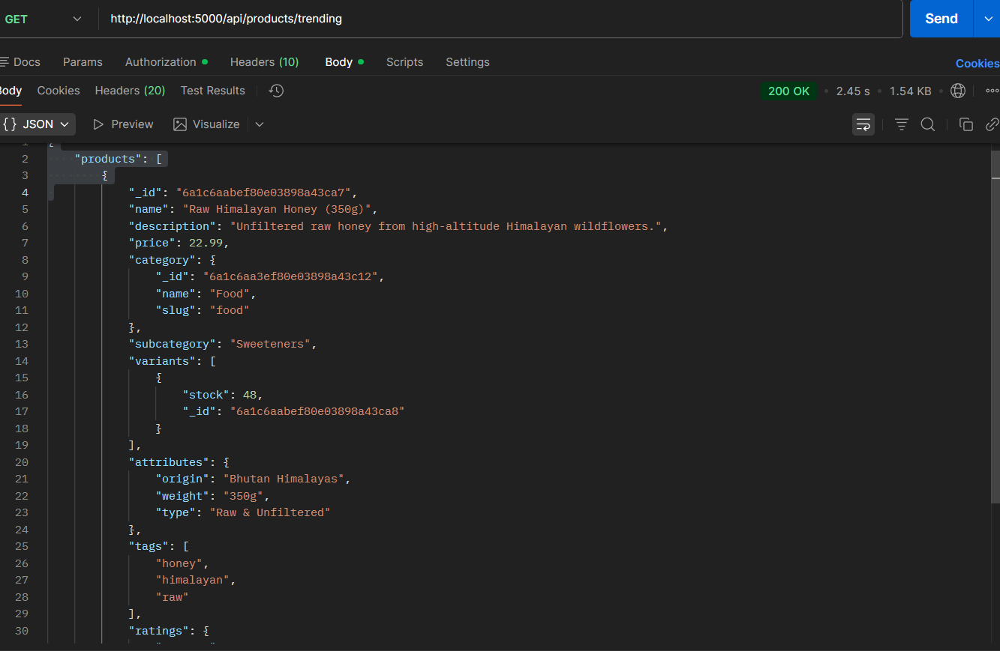

### 9.3 Cart (`/api/cart`)

| Method | Path | Auth | Description |
|---|---|---|---|
| GET | `/api/cart` | JWT | Fetch cart with total |
| POST | `/api/cart` | JWT | Add or increment item in cart |
| PUT | `/api/cart/:productId` | JWT | Update item quantity |
| DELETE | `/api/cart/:productId` | JWT | Remove single item |
| DELETE | `/api/cart` | JWT | Clear entire cart |
| GET | `/api/cart/recent` | JWT | Recently viewed products (from Redis list) |
| POST | `/api/cart/recent` | JWT | Add product to recently viewed |

### 9.4 Orders (`/api/orders`)

| Method | Path | Auth | Description |
|---|---|---|---|
| POST | `/api/orders` | JWT + Rate limit (5/60s) | Place order from cart with ACID transaction |
| GET | `/api/orders` | JWT | List own orders with pagination |
| GET | `/api/orders/:id` | JWT | Single order detail |
| PUT | `/api/orders/:id/status` | Admin | Advance order through status state machine |

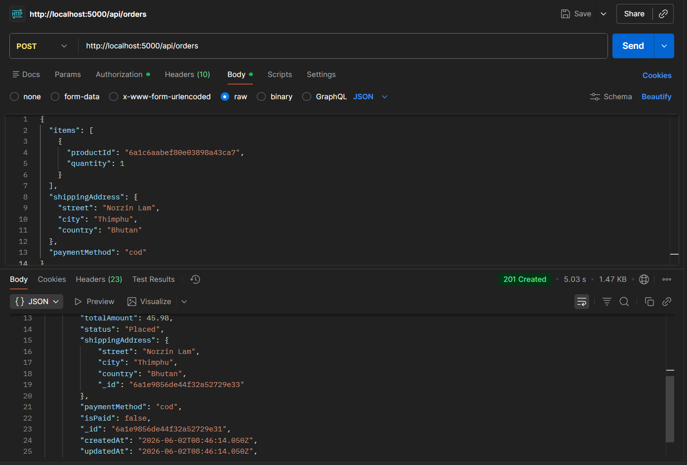


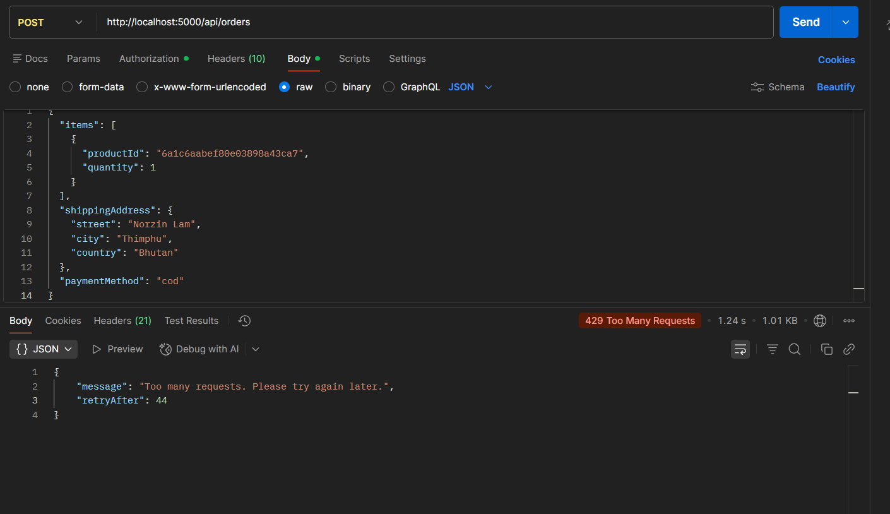

### 9.5 Analytics (`/api/analytics`)

| Method | Path | Auth | Description |
|---|---|---|---|
| GET | `/api/analytics/sales` | Admin | Monthly revenue aggregation |
| GET | `/api/analytics/top-products` | Admin | Top 10 products by sales volume |

### 9.6 System

| Method | Path | Auth | Description |
|---|---|---|---|
| GET | `/health` | Public | Health check for load balancers |
| GET | `/api/routes` | Public | Introspected list of all registered routes |

---

## 10. Performance Benchmarks

### 10.1 Cache Hit vs. Database Response Time

The fundamental performance benefit of the cache-aside pattern is the elimination of network I/O to MongoDB on repeated reads. The expected latency profile is as follows:

| Request Type | Latency Source | Expected Range |
|---|---|---|
| Redis cache hit | In-memory lookup + network to Redis Cloud (us-east-1) | 1–5 ms |
| MongoDB cache miss | Network to Atlas + index scan + document fetch + JSON serialisation | 20–80 ms |
| Cold start (no cache, no index) | Full collection scan | 100–500 ms (varies with collection size) |

### 10.2 Rate Limit Enforcement

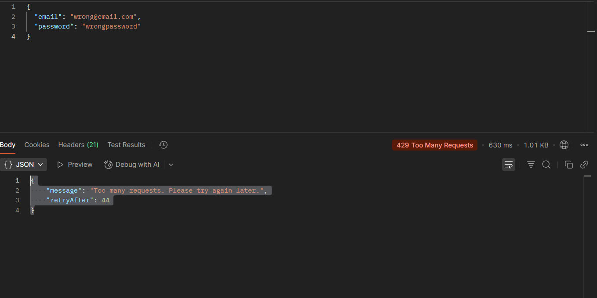

---

## 11. Challenges and Solutions

### 11.1 Mongoose `async` Pre-Save Hook — `next is not a function`

**Problem:** The User model's password hashing hook was declared as `async function(next)`. Mongoose's middleware engine (Kareem) detects `async` functions by inspecting `fn.constructor.name === 'AsyncFunction'` and resolves them via the returned Promise rather than by passing a `next` callback. As a result, `next` received `undefined`, causing `TypeError: next is not a function` at runtime [7].

**Solution:** Removed the `next` parameter entirely from the async hook. The `return` statement provides the early-exit behaviour previously handled by `return next()`.

```javascript
// Before (broken)
userSchema.pre('save', async function(next) {
  if (!this.isModified('password')) return next();
  this.password = await bcrypt.hash(this.password, 12);
  next();
});

// After (correct)
userSchema.pre('save', async function() {
  if (!this.isModified('password')) return;
  this.password = await bcrypt.hash(this.password, 12);
});
```

### 11.2 Route Ordering — `/:id` Matching Static Segments

**Problem:** Express matches routes in registration order. `GET /api/products/trending` was being matched by `GET /api/products/:id`, which bound the string `"trending"` to `req.params.id`. MongoDB then attempted to cast `"trending"` to an ObjectId, throwing `CastError: Cast to ObjectId failed for value "trending"`.

**Solution:** Registered the static `/trending` route before the dynamic `/:id` route in `src/routes/product.js`:

```javascript
router.get('/', getProducts);
router.get('/trending', getTrendingProducts);  // Must be before /:id
router.get('/:id', getProductById);
```

### 11.3 Mongoose Model Registration — `Schema hasn't been registered`

**Problem:** The `GET /api/products` controller calls `.populate('category', 'name slug')`, which requires Mongoose to have the `Category` model registered. Because `Category` was only imported by its own route file, and that route file was loaded after the product controller attempted population, Mongoose threw `Schema hasn't been registered for model "Category"`.

**Solution:** Added explicit `require()` calls for all six models at the top of `src/index.js`, ensuring they are registered before any route handler executes:

```javascript
require('./models/User');
require('./models/Product');
require('./models/Category');
require('./models/Order');
require('./models/Review');
require('./models/Inventory');
```

### 11.4 Concurrent Inventory Decrement Without Double-Spending

**Problem:** A naive implementation might read stock, check it in application code, then decrement it in a separate write. Under concurrent load, two requests could both read `stock: 1`, both pass the check, and both decrement to produce `stock: -1`.

**Solution:** Combined the check and decrement into a single atomic `findOneAndUpdate` with a guard predicate, wrapped in a multi-document transaction:

```javascript
const inv = await Inventory.findOneAndUpdate(
  { productId: item.productId, stock: { $gte: item.quantity } },
  { $inc: { stock: -item.quantity } },
  { session, new: true }
);
if (!inv) { await session.abortTransaction(); /* ... */ }
```

MongoDB's document-level locking ensures that two concurrent updates to the same inventory document are serialised. The guard predicate `stock: { $gte: item.quantity }` means the decrement is a no-op (returns `null`) if stock is already insufficient.

### 11.5 Cart Clear Timing After Transaction Commit

**Problem:** If the cart is deleted inside the transaction and the transaction subsequently aborts, the cart is lost even though no order was placed. If it is deleted outside the transaction and the process crashes after commit but before the delete, the user retains a cart for an order that has already been placed.

**Solution:** Cart deletion is performed outside and after the committed transaction (`await redis.del(cartKey)` after `session.commitTransaction()`). The worst-case outcome of a crash at this point is a stale cart in Redis that expires naturally after 7 days, a minor UX inconvenience and not a data integrity problem, because the order is durably committed in MongoDB.

---

## 12. Future Enhancements

### 12.1 Redis Sentinel / Cluster for High Availability

The current Redis Cloud configuration uses a single primary node. For production workloads, Redis Sentinel (automatic failover) or Redis Cluster (horizontal partitioning) would eliminate Redis as a single point of failure. ioredis supports both configurations natively.

### 12.2 Product Image Storage

Product listings currently store only text attributes. Integration with object storage (AWS S3 or Cloudflare R2) would allow sellers to upload product images. Pre-signed URLs would enable direct browser-to-storage uploads, bypassing the API server for large binaries.

### 12.3 Search with Elasticsearch or Atlas Search

MongoDB's built-in `$text` operator supports basic keyword matching but lacks advanced features such as fuzzy matching, synonym expansion, faceted search, and typo tolerance. Migrating the product search to MongoDB Atlas Search (which uses Apache Lucene under the hood) or a dedicated Elasticsearch cluster would significantly improve search relevance for a large product catalogue.

### 12.4 Event-Driven Notifications

Order status transitions currently produce no side effects beyond the database update. Integrating a message queue (Redis Streams, BullMQ, or Apache Kafka) would decouple order events from notification delivery, enabling email/SMS confirmations, inventory reorder alerts, and real-time order tracking updates without blocking the HTTP response.

### 12.5 Cache Stampede Prevention

As described in Section 7.4, high-traffic deployments risk cache stampedes on popular product pages after a TTL expiry. Implementing the `SET NX EX` mutex pattern or probabilistic early expiration (PER) would prevent thundering-herd behaviour on the MongoDB layer during cache invalidation.

### 12.6 GraphQL API Layer

The current REST API requires multiple round trips for complex client views (e.g., fetching a product with its reviews and inventory status). A GraphQL layer would allow clients to declare their data requirements in a single query, reducing over-fetching and under-fetching.

### 12.7 Distributed Tracing

Production observability currently relies on console logging. Integrating OpenTelemetry with a backend such as Jaeger or Datadog would provide distributed traces across the MongoDB and Redis layers, enabling P99 latency analysis and bottleneck identification.

---

## 13. References

[1] R. Dahl, "Node.js: Evented I/O for V8 JavaScript," presented at JSConf EU, Berlin, Germany, 2009. [Online]. Available: https://nodejs.org

[2] MongoDB Inc., *MongoDB Manual: Data Modeling Introduction*, MongoDB Documentation, 2024. [Online]. Available: https://www.mongodb.com/docs/manual/core/data-modeling-introduction/

[3] S. Sanfilippo and P. Noordhuis, *Redis Documentation: Data Types*, Redis Ltd., 2024. [Online]. Available: https://redis.io/docs/data-types/

[4] P. Flajolet, É. Fusy, O. Gandouet, and F. Meunier, "HyperLogLog: the analysis of a near-optimal cardinality estimation algorithm," in *Proc. Conf. on Analysis of Algorithms (AofA)*, Juan des Pins, France, 2007, pp. 127–146.

[5] K. Chodorow, *MongoDB: The Definitive Guide*, 3rd ed. Sebastopol, CA: O'Reilly Media, 2019, ch. 3–4.

[6] MongoDB Inc., *MongoDB Atlas: Replica Sets*, MongoDB Documentation, 2024. [Online]. Available: https://www.mongodb.com/docs/atlas/reference/replica-set-tags/

[7] V. Kareem (Automattic), *Kareem: Middleware Library for Mongoose*, GitHub, 2023. [Online]. Available: https://github.com/nicedoc/kareem

[8] Express.js Contributors, *Express 5.x API Reference*, OpenJS Foundation, 2024. [Online]. Available: https://expressjs.com/en/5x/api.html

[9] M. Fowler, "Cache-Aside Pattern," in *Patterns of Enterprise Application Architecture*. Boston, MA: Addison-Wesley, 2002, ch. 15.

[10] OWASP Foundation, *OWASP Top Ten 2021*, Open Web Application Security Project, 2021. [Online]. Available: https://owasp.org/Top10/

---

